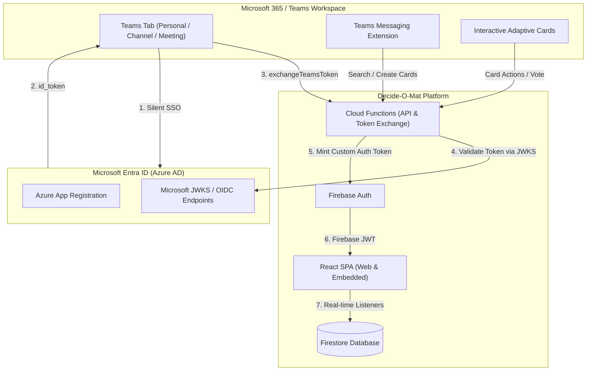

# Epic: Microsoft Azure, Entra ID (Azure AD) & Microsoft Teams Integration

**Epic ID**: `EPIC-AZURE-01`  
**Status**: Planned  
**Target Milestone**: v2.1  

## Overview & Business Context

Decide-O-Mat is expanding into enterprise and corporate team environments where Microsoft 365 (M365) and Microsoft Teams are the primary communication, identity, and collaboration hubs.

This epic introduces end-to-end integration with the Microsoft ecosystem:
1. **Enterprise Identity & Access Management**: Corporate single sign-on (SSO) using Microsoft Entra ID (formerly Azure Active Directory) supporting work/school accounts, multi-tenancy, and dedicated company tenant restrictions.
2. **Microsoft Teams App Integration**: Embedding Decide-O-Mat as a first-class citizen inside Microsoft Teams across personal tabs, collaborative channel tabs, live meeting side panels/stage views, messaging extensions, and interactive Adaptive Cards.

---

## User Stories Breakdown

| Story ID | Title | Summary |
| :--- | :--- | :--- |
| [US-039](US-039-Entra-ID-Authentication.md) | **Microsoft Entra ID (Azure AD) Web SSO** | Enable users to sign in or link accounts with corporate Microsoft Entra ID credentials. |
| [US-040](US-040-Enterprise-Tenant-Restrictions.md) | **Enterprise Tenant Isolation & Scoping** | Enforce company Tenant ID restrictions and verified domain policies. |
| [US-041](US-041-Teams-App-Foundation.md) | **Microsoft Teams App Manifest & SDK Integration** | Provide the Teams app package, CSP `frame-ancestors`, and theme synchronization. |
| [US-042](US-042-Teams-Silent-SSO.md) | **Microsoft Teams Silent Single Sign-On (SSO)** | Acquire Entra ID tokens silently in Teams tabs and exchange them for Firebase auth tokens. |
| [US-043](US-043-Teams-Channel-Meeting-Tabs.md) | **Teams Channel Tabs & Live Meeting Extension** | Pin decisions to Teams channels and provide live sidepanel & stage view during Teams calls. |
| [US-044](US-044-Teams-Messaging-Extension.md) | **Teams Messaging Extension & Link Unfurling** | Create, search, and unfurl decision cards directly inside Teams chat message boxes. |
| [US-045](US-045-Teams-Adaptive-Cards.md) | **Teams Bot & Interactive Adaptive Cards** | Vote on decisions and receive automated status updates directly in chat feeds. |

---

## Architectural & Security Decisions

1. **Dual Authentication Strategy**:
   - **Web Browser**: Standard Firebase Auth `OAuthProvider('microsoft.com')` popup/redirect.
   - **Teams Embedded Tab**: Native Teams JS SDK silent SSO via custom token exchange to avoid popup blocking in Teams desktop/mobile apps.
2. **End-to-End Encryption (E2EE) Compatibility**:
   - Entra ID user identity maps cleanly to existing user keystores. Master decryption keys for private decisions can be wrapped with user public keys or shared via encrypted channel context.
3. **Data Security & Multi-Tenancy**:
   - Organization tenant IDs (`tid`) stored in user profiles and decision metadata.
   - Firestore security rules ensure decisions marked as tenant-restricted can only be read or modified by authenticated users with matching tenant tokens.
